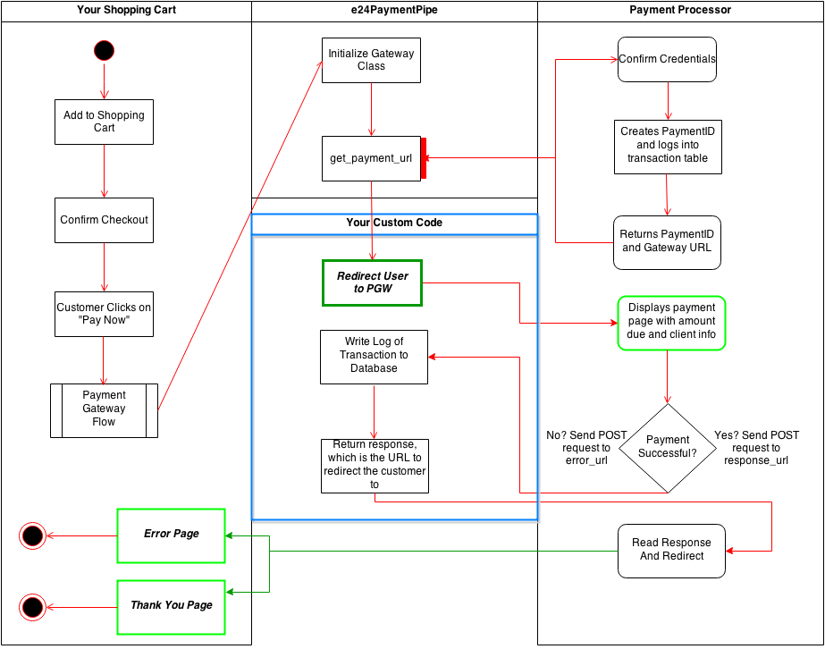

==========
Quickstart
==========

In order to use this module, you need to obtain a resource file and the alias for your terminal
from your payment provider.

This file will allow the module to connect to the gateway server to initialize your transaction workflow.

Payment Flow Diagram
--------------------

This diagram illustrates the typical flow for the e24PaymentPipe gateway, and how the various components fit together:

This module provides the functionality contained in the block marked e24PaymentPipe. In a typical use case,
you would write the functionality defined in the blue box in order to integrate the payment gateway with
and existing system.

The green highlighted boxes show where the user will be redirected to.

For a sample implementation of this gateway, check out https://github.com/burhan/e24-sample-cart

Minimal Example
---------------

The quick demo for the impatient::

	from e24PaymentPipe import Gateway

	pgw = Gateway('resource.cgn', 'alias')
	pgw.error_url = 'http://example.com/error'
	pgw.response_url = 'http://example.com/response'
	pgw.amount = 1.0
	gw_info = pgw.get_payment_url()

**The snippet above will create a transaction in KWD, the default currency for the system. To override this, see the module documentation.**

The :py:func:`get_payment_url` method will return a dictionary with two keys paymentID and paymentURL.  You need to store the paymentID in your database (as part of the transaction requirements) and then attach it at the end of the paymentURL to start the transaction initiation process.
